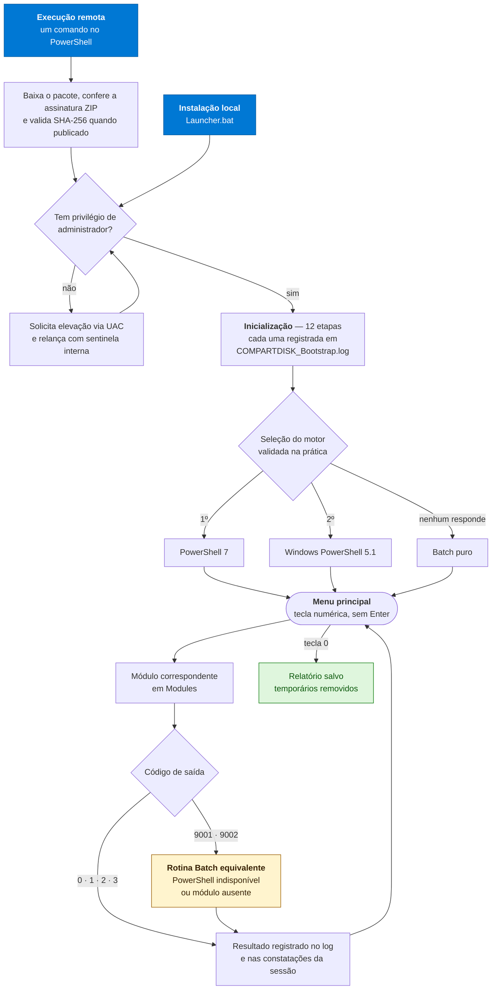
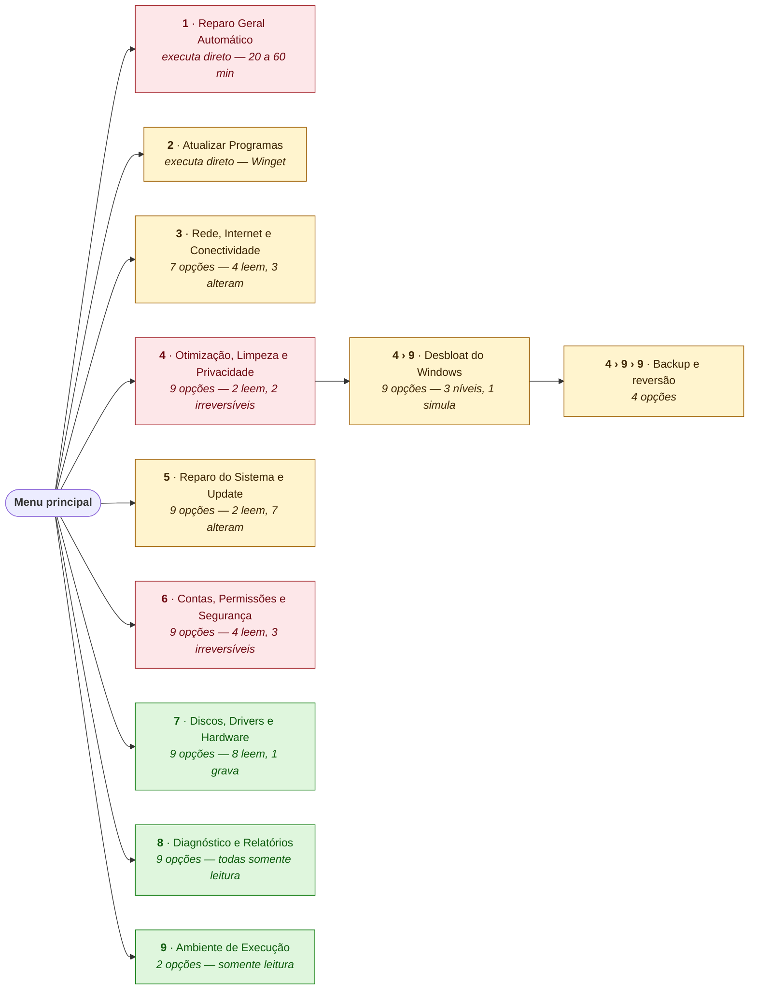
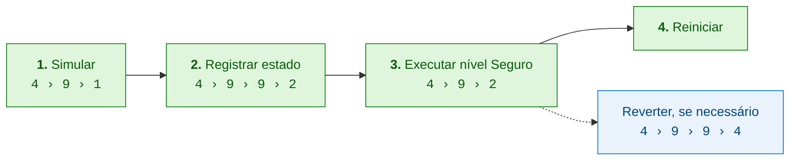

# COMPARTDISK

<p align="left">
  <a href="LICENSE">
    
  </a>
  <a href="CHANGELOG.md">
    
  </a>
  <a href="#3-pré-requisitos">
    
  </a>
  <a href="#3-pré-requisitos">
    
  </a>
</p>

**Assistente de Reparo para Windows**

Ferramenta de manutenção que reúne, em menus numerados, as tarefas de reparo,
limpeza, diagnóstico e verificação de segurança do Windows. Usa exclusivamente
componentes nativos do sistema operacional, sem instalação e sem dependências.
Compatível atualmente com Windows 10 e Windows 11.

> Desenvolvido por Edsilas

---

## Índice

| Seção | Conteúdo |
|---|---|
| [1. Visão geral](#1-visão-geral) | O que a ferramenta faz e a quem se destina |
| [2. Como funciona](#2-como-funciona) | Fluxo de execução, do comando ao relatório |
| [3. Recursos](#3-recursos) | Capacidades principais |
| [4. Pré-requisitos](#4-pré-requisitos) | O que é necessário antes de começar |
| [5. Início rápido](#5-início-rápido) | Executar em um comando ou instalar localmente |
| [6. Interface](#6-interface) | Como a ferramenta se apresenta e o mapa dos menus |
| [7. Desbloat do Windows](#7-desbloat-do-windows) | Remover o que veio pré-instalado |
| [8. Uso avançado](#8-uso-avançado) | Execução desassistida e parque de máquinas |
| [9. Segurança e privacidade](#9-segurança-e-privacidade) | O que a ferramenta faz e não faz com seus dados |
| [10. Documentação](#10-documentação) | Índice completo dos guias e manuais |
| [11. Solução de problemas](#11-solução-de-problemas) | Primeiros passos quando algo falha |
| [12. Contribuindo](#12-contribuindo) | Como relatar problemas e sugerir melhorias |
| [13. Licença](#13-licença) | Termos de uso e distribuição |
| [14. Marcas registradas](#14-marcas-registradas) | Avisos legais |

---

## 1. Visão geral

O COMPARTDISK reúne, em um único programa, as tarefas de manutenção que normalmente
exigiriam dezenas de comandos digitados à mão: reparar o Windows, consertar a
internet, liberar espaço em disco, verificar a saúde dos discos, revisar a segurança
do computador e gerar um relatório completo do estado da máquina.

Você navega por menus numerados. Escolhe uma opção, aperta a tecla, e a ferramenta
faz o resto — explicando na tela o que está acontecendo e registrando tudo em um
arquivo de log.

### A quem se destina

| Perfil | Como a ferramenta ajuda |
|---|---|
| **Usuário doméstico** | Resolve problemas comuns sem precisar pesquisar comandos ou seguir tutoriais |
| **Técnico de suporte** | Padroniza o diagnóstico e gera um relatório anexável ao chamado |
| **Administrador de TI** | Executa auditorias desassistidas em parque de máquinas, com saída em CSV e JSON |

> [!NOTE]
> Não é preciso saber programar. Não é preciso conhecer PowerShell nem Batch.

---

## 2. Como funciona

O arquivo `Launcher.bat` **é o programa**: nele estão a interface, os menus, a
autoelevação, a detecção de ambiente e o controle de fluxo. O PowerShell é um **motor
acoplável** — quando existe, assume as operações complexas; quando não existe, o
Batch executa a mesma funcionalidade por rotinas próprias.

> **Regra de ouro do projeto:** nenhuma funcionalidade deixa de existir por ausência
> de PowerShell.

### Fluxo de execução



Se a partida falhar, a última linha de `%TEMP%\COMPARTDISK_Bootstrap.log` aponta
exatamente em qual das doze etapas o processo parou.

### Detecção de privilégio

A verificação é feita em três camadas, nesta ordem: `fltmc`, `net session` e escrita
de teste em `HKLM`. O `net session` não é usado isoladamente porque falha quando o
serviço *Server* está parado — comum em Windows Home e imagens corporativas
endurecidas, cenário em que um administrador legítimo seria classificado como usuário
comum.

Detalhes completos em [Arquitetura](docs/ARQUITETURA.md).

---

## 3. Recursos

| Recurso | Descrição |
|---|---|
| **Reparo automático** | Corrige em sequência os problemas mais comuns do Windows, com uma única tecla |
| **Diagnóstico completo** | Gera o retrato da máquina em quatro formatos: TXT, CSV, JSON e HTML |
| **Rede e internet** | Restaura conectividade, DNS, Winsock, firewall e proxy |
| **Limpeza de disco** | Inclui modo de simulação, que mede o espaço recuperável antes de apagar |
| **Segurança** | Revisa Defender, firewall, contas, BitLocker, TPM e Secure Boot |
| **Hardware e discos** | Saúde física dos discos, desgaste da bateria, drivers e inventário completo |
| **Desbloat do Windows** | Remove aplicativos pré-instalados, com simulação, três níveis de risco e reversão |
| **Operação sem PowerShell** | Cada função possui rotina Batch equivalente para ambientes restritos |
| **Execução remota** | Um único comando executa a versão mais recente, com validação de integridade |

---

## 4. Pré-requisitos

### Sistema operacional

- Windows — compatível atualmente com Windows 10 (versão 1809 ou superior) e Windows 11
- Edições Home, Pro, Education ou Enterprise
- Arquitetura x64 ou ARM64

### Permissões

- Conta com privilégio de administrador

A ferramenta solicita a elevação automaticamente ao iniciar. Sem privilégio
administrativo, o Windows recusaria a maior parte das operações.

### Componentes opcionais

Nenhum é obrigatório. A ausência de qualquer um reduz a profundidade do diagnóstico,
mas **não remove funcionalidades**.

| Componente | Se presente | Se ausente |
|---|---|---|
| Windows PowerShell 5.1 | Diagnóstico completo e relatórios nos quatro formatos | Rotinas Batch assumem |
| PowerShell 7 | O mesmo, com melhor desempenho | O PowerShell 5.1 é utilizado |
| Winget | Atualização de programas instalados | A opção informa indisponibilidade |
| PnPUtil | Backup e inventário de drivers | A opção informa indisponibilidade |

> [!TIP]
> Para verificar o que foi detectado na sua máquina, abra a opção **[9] Ambiente de
> Execução e Capacidades** no menu principal.

Detalhes completos em [Requisitos do Sistema](docs/REQUISITOS.md) e
[Compatibilidade](docs/COMPATIBILIDADE.md).

---

## 5. Início rápido

Há dois métodos de execução. Ambos rodam **o mesmo programa**, com os mesmos menus,
módulos e fluxos.

### Método A — Execução remota (um comando)

Sempre executa a versão estável mais recente, sem download manual e sem verificar
atualizações. Abra o **PowerShell como administrador** e execute:

```powershell
irm https://compartdisk.com.br/run | iex
```

O inicializador consulta a versão mais recente, baixa o pacote, confere a assinatura
de arquivo ZIP e — quando a versão publica o valor nas notas da release — **valida a
integridade por SHA-256**; se o valor não estiver publicado, o script avisa na tela e
prossegue. Em seguida executa o `Launcher.bat`. Ao encerrar, remove todos os arquivos
temporários — nada permanece no disco.

<details>
<summary>Endereço alternativo, direto pelo repositório</summary>

<br>

O endereço curto apenas encaminha para o script hospedado aqui no GitHub — nenhuma
cópia é mantida fora do repositório. Se preferir não depender do domínio, ou se ele
estiver indisponível, use a origem diretamente:

```powershell
irm https://raw.githubusercontent.com/edsilas/compartdisk/main/remote.ps1 | iex
```

Os dois comandos executam exatamente a mesma coisa.

</details>

> [!TIP]
> Indicado para uso pontual e atendimento de suporte. Para uso recorrente ou em
> máquinas com internet limitada, prefira o método B.

Detalhes, validação de integridade e configuração avançada em
[Guia de Execução Remota](docs/EXECUCAO-REMOTA.md).

### Método B — Instalação local

#### Passo 1 — Baixar e extrair

1. Baixe o pacote mais recente em [Releases](https://github.com/edsilas/compartdisk/releases/latest).
2. Clique com o botão direito no arquivo `.zip`, selecione **Propriedades**, marque
   **Desbloquear** e clique em **OK**.
3. Extraia o conteúdo para uma pasta, por exemplo `C:\COMPARTDISK`.

> [!IMPORTANT]
> Não execute a ferramenta de dentro do arquivo compactado. O Windows abre o
> conteúdo em uma pasta temporária somente leitura, e os relatórios não poderão ser
> gravados.

#### Passo 2 — Executar

1. Clique com o botão direito em **`Launcher.bat`**.
2. Selecione **Executar como administrador**.
3. Confirme a solicitação do Controle de Conta de Usuário.

Não há instalador, dependências para baixar ou alterações permanentes no sistema.
Para desinstalar, apague a pasta.

#### Passo 3 — Primeiro diagnóstico

Comece por operações que **não alteram nada** no computador:

| Ordem | Caminho | Resultado |
|---|---|---|
| 1 | Menu **[9]** | Mostra o que a ferramenta detectou no seu Windows |
| 2 | Menu **[8]** → opção **[2]** | Auditoria rápida, em menos de um minuto |
| 3 | Menu **[8]** → opção **[1]** | Auditoria completa, com relatório HTML |
| 4 | Menu **[4]** → opção **[4]** | Simula a limpeza e mede o espaço recuperável |

Somente depois disso vale usar as opções que modificam o sistema.

Instruções detalhadas em [Guia de Instalação](docs/INSTALACAO.md).

### Qual método usar

| Critério | Execução remota | Instalação local |
|---|---|---|
| Versão executada | Sempre a mais recente | A que você baixou |
| Ocupa espaço em disco | Não | Menos de 1 MB |
| Funciona sem internet | Não | Sim |
| Indicado para | Uso pontual, suporte técnico | Uso recorrente, parque de máquinas |

---

## 6. Interface

```text
  COMPARTDISK  1.3.1
  Assistente de Reparo

  --------------------------------------------------------------------------

   [1]  Reparo Geral Automatico (One-Click Fix)
   [2]  Atualizar Programas (Winget)
   [3]  Rede, Internet e Conectividade
   [4]  Otimizacao, Limpeza Profunda e Privacidade
   [5]  Reparo do Sistema, Windows Update e Explorer
   [6]  Contas, Permissoes e Seguranca
   [7]  Discos, Drivers e Auditoria de Hardware
   [8]  Diagnostico Avancado e Relatorios (TXT/CSV/JSON/HTML)
   [9]  Ambiente de Execucao e Capacidades

   [0]  Sair e Salvar Relatorio

  --------------------------------------------------------------------------
  Motor: Windows PowerShell 5.1
  Log:   C:\COMPARTDISK\Relatorio_Manutencao.txt
  DESENVOLVIDO POR EDSILAS

  Opcao:
```

A navegação é feita por teclas numéricas, sem necessidade de pressionar Enter. A
tecla `0` retorna à tela anterior. O rodapé indica qual motor está em uso e onde o
registro está sendo gravado.

### Mapa dos menus

Duas opções executam direto; as demais abrem submenus. O número entre parênteses é a
quantidade de opções de cada tela.



<sub>🟩 somente leitura · 🟨 altera e é reversível · 🟥 contém operação definitiva</sub>

Mapa completo das telas, opção por opção, em
[Descrição dos Menus](docs/MENUS.md).

---

## 7. Desbloat do Windows

O Windows chega ao usuário com programas que ele não escolheu: jogos promocionais,
testes de antivírus, aplicativos de fabricante, sugestões no menu Iniciar. Somam-se
serviços e tarefas agendadas que rodam em segundo plano para funções que muita gente
nunca usa.

O módulo de desbloat remove esses itens de forma controlada. Fica em
**`[4]` Otimização › `[9]` Desbloat do Windows**.

### Três níveis

| Nível | O que inclui | Segurança | Para quem |
|---|---|:---:|---|
| **Seguro** | 104 itens promocionais ou descontinuados | 🟢 Alto | Qualquer pessoa. É o recomendado |
| **Moderado** | 143 itens, somando Xbox, mídia, Fotos, Câmera, Email | 🟡 Médio | Quem sabe quais aplicativos usa |
| **Avançado** | 150 itens, somando busca do Iniciar e `/ResetBase` | 🔴 Baixo | Administradores e usuários experientes |

Os níveis são cumulativos.

### Ordem recomendada



A simulação lista item por item o que seria alterado, com o motivo técnico de cada
um, **sem tocar em nada**.

### O que o distingue

**Proteções com precedência absoluta.** Um conjunto de 48 aplicativos, 7 prefixos de
família, 56 serviços e 4 ramos de registro nunca é tocado — Microsoft Store, Defender,
bibliotecas de runtime, autenticação, codecs, Windows Update, rede. Essa verificação
acontece **depois** de qualquer filtro do operador, de propósito: nem quem opera a
ferramenta consegue contorná-la.

**Reversão pelo estado anterior.** Cada alteração grava como o item estava antes.
Serviços, tarefas e ajustes de registro voltam ao valor exato de origem — inclusive
removendo valores que não existiam, em vez de gravar zero.

**Ponto de restauração como portão.** A rotina completa cria um antes de qualquer
alteração e se recusa a prosseguir se não conseguir.

### O que não volta

Aplicativos removidos precisam ser reinstalados pela Microsoft Store: o Windows não
retém o pacote no disco depois de removê-lo. A limpeza de componentes obsoletos
também é definitiva. Por isso a simulação existe — use antes.

A referência completa — cada nível, cada submódulo, o que exatamente é alterado e como
reverter — está no [Módulo de Desbloat](docs/DESBLOAT.md).

---

## 8. Uso avançado

### Parâmetros de linha de comando

```bat
Launcher.bat /autofix    :: reparo geral automático e encerra
Launcher.bat /audit      :: auditoria completa com os quatro relatórios
Launcher.bat /report     :: consolida e gera apenas os relatórios
Launcher.bat /clean      :: limpeza profunda
Launcher.bat /?          :: exibe a ajuda
```

Em modo desassistido não há menus nem pausas. O processo encerra com código de saída
`0`, o que permite encadeamento em scripts. O diagnóstico de cada execução fica no
log de texto e nos relatórios da sessão — no JSON, o campo `Findings` traz a
severidade de cada constatação.

### Coleta centralizada

```bat
set "COMPARTDISK_LOGDIR=\\servidor\inventario\%COMPUTERNAME%\"
\\servidor\ferramentas\compartdisk\Launcher.bat /audit
```

Cada máquina grava em sua própria subpasta. Os arquivos `.csv` e `.json` são
destinados a consumo automatizado; no JSON, filtre `Findings` por
`Severity = "CRIT"` para identificar as máquinas que exigem atenção.

Orientações completas em [Manual do Administrador](docs/MANUAL-DO-ADMINISTRADOR.md).

---

## 9. Segurança e privacidade

### Transparência

- Todo o código é aberto e legível: são arquivos de texto, sem binários compilados.
- Utiliza **apenas** componentes que já acompanham o Windows. Nada é baixado da internet.
- Não cria serviços, tarefas agendadas próprias ou entradas de inicialização.
- Não permanece em execução após ser fechada.

### Proteções

- Antes de operações destrutivas é feito backup automático: arquivo `hosts`, regras
  de firewall, diretivas de grupo e logs de eventos.
- Operações sensíveis exigem confirmação explícita.
- A remoção de arquivos recusa caminhos críticos do sistema.

### Dados nos relatórios

Os relatórios contêm nome do computador, nome de usuário, número de série do
equipamento, configuração de rede e lista de programas instalados. **Não** contêm
senhas, arquivos pessoais ou histórico de navegação.

> [!WARNING]
> Chaves de recuperação do BitLocker podem ser exibidas na tela quando solicitadas,
> mas **nunca são gravadas em arquivo**. Trate os relatórios conforme a política de
> classificação de informação da sua organização.

---

## 10. Documentação

### Introdução

| Documento | Conteúdo |
|---|---|
| [Guia de Instalação](docs/INSTALACAO.md) | Baixar, descompactar e executar pela primeira vez |
| [Guia de Execução Remota](docs/EXECUCAO-REMOTA.md) | Executar em um comando, sempre na versão mais recente |
| [Guia de Configuração](docs/CONFIGURACAO.md) | Onde ficam os logs e como ajustar o comportamento padrão |
| [Guia de Utilização](docs/UTILIZACAO.md) | Como navegar pelos menus no dia a dia |
| [Manual do Usuário](docs/MANUAL-DO-USUARIO.md) | Explicação de cada opção, em linguagem simples |

### Referência

| Documento | Conteúdo |
|---|---|
| [Descrição dos Menus](docs/MENUS.md) | Mapa completo de todas as telas e opções |
| [Módulo de Desbloat](docs/DESBLOAT.md) | Referência completa: níveis, submódulos, proteções e reversão |
| [Funcionalidades](docs/FUNCIONALIDADES.md) | Descrição técnica de cada recurso |
| [Requisitos do Sistema](docs/REQUISITOS.md) | O que é necessário para executar |
| [Compatibilidade](docs/COMPATIBILIDADE.md) | Edições do Windows e comportamento em cada uma |
| [Limitações Conhecidas](docs/LIMITACOES.md) | O que a ferramenta não faz, e por quê |
| [Boas Práticas](docs/BOAS-PRATICAS.md) | Como utilizar com segurança |

### Suporte

| Documento | Conteúdo |
|---|---|
| [Perguntas Frequentes](docs/FAQ.md) | Dúvidas comuns respondidas de forma objetiva |
| [Solução de Problemas](docs/SOLUCAO-DE-PROBLEMAS.md) | Diagnóstico organizado por sintoma |

### Avançado

| Documento | Conteúdo |
|---|---|
| [Manual do Administrador](docs/MANUAL-DO-ADMINISTRADOR.md) | Parque de máquinas, GPO e execução desassistida |
| [Manual Técnico](docs/MANUAL-TECNICO.md) | Estrutura interna, API dos módulos e como estender |
| [Arquitetura](docs/ARQUITETURA.md) | Como o Batch e o PowerShell se combinam |
| [Estrutura do Projeto](docs/ESTRUTURA.md) | Função de cada arquivo e pasta |
| [Política de Atualização](docs/ATUALIZACAO.md) | Como atualizar e o que muda entre versões |

### Projeto

| Documento | Conteúdo |
|---|---|
| [Histórico de Mudanças](CHANGELOG.md) | O que mudou em cada versão |
| [Licença](LICENSE) | Termos de uso e distribuição |
| [Créditos](docs/CREDITOS.md) | Autoria e reconhecimentos |

---

## 11. Solução de problemas

| Sintoma | Primeira verificação |
|---|---|
| A janela abre e fecha imediatamente | Consulte `%TEMP%\COMPARTDISK_Bootstrap.log`; a última linha indica o estágio em que a inicialização parou |
| Aparece "O Windows protegeu o computador" | É o SmartScreen. Clique em **Mais informações** e depois em **Executar assim mesmo** |
| O rodapé indica "Motor: Batch" | O PowerShell está indisponível ou bloqueado. Todas as funções continuam acessíveis |
| Uma opção informa "recurso não suportado" | O hardware ou a edição do Windows não possui aquele recurso |
| A tela parece travada | Reparo profundo e varreduras levam de 15 minutos a 4 horas, sem exibir progresso |
| A execução remota falha ao baixar | Verifique proxy e firewall; o script exibe a causa e as alternativas |

Guia completo em [Solução de Problemas](docs/SOLUCAO-DE-PROBLEMAS.md).

---

## 12. Contribuindo

Relatos de problema, sugestões e melhorias são bem-vindos em
[Issues](https://github.com/edsilas/compartdisk/issues).

Ao relatar um problema, inclua:

1. A versão da ferramenta (visível no menu **[9]**)
2. A edição e a versão do Windows
3. O arquivo `%TEMP%\COMPARTDISK_Bootstrap.log`
4. O relatório HTML, se for possível gerá-lo

---

## 13. Licença

Distribuído sob a Licença Apache 2.0. Consulte o arquivo [LICENSE](LICENSE) para os
termos completos.

---

## 14. Marcas registradas

Windows, Windows 10, Windows 11, PowerShell, Microsoft Defender e BitLocker são
marcas registradas da Microsoft Corporation. Este projeto não é afiliado,
patrocinado ou endossado pela Microsoft.

---

<div align="center">

**COMPARTDISK 1.3.1** — Desenvolvido por Edsilas

https://github.com/edsilas/compartdisk

</div>
